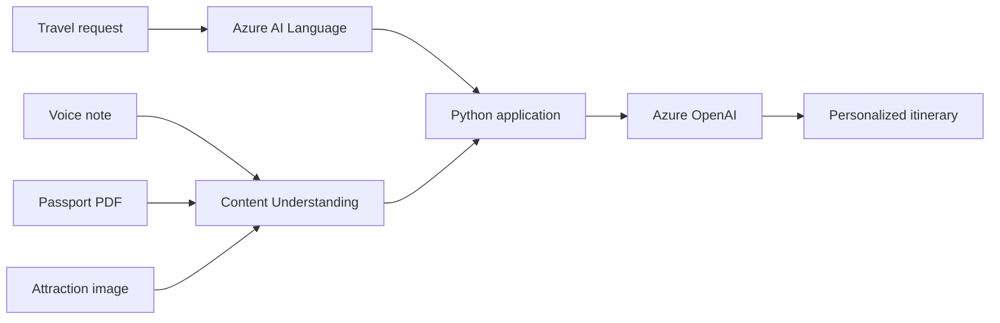

## Business scenario

A travel company wants to help customers plan trips more efficiently. Customers can
submit a text request, a voice note, a passport or identity document, and an image of
a destination or attraction. The application must analyze these inputs and generate a
personalized travel recommendation.

Your team will design and build a Python application that combines multiple Azure AI
services. You must determine which Azure AI service and model best fit each requirement,
explain your choices, and integrate the services into one workflow.

## Lab at a glance

Build the simplest working version first. Use three Azure integrations:

| Input or task          | Recommended service       | Expected result                       |
|------------------------|---------------------------|---------------------------------------|
| Travel request text    | Azure AI Language         | Language, key phrases, and entities   |
| Audio, PDF, and image  | Content Understanding     | Transcription and structured insights |
| Itinerary generation   | Azure OpenAI              | Personalized five-day itinerary       |

You do not need to build separate Speech, Vision, and Document Intelligence integrations
for the minimum solution. They are optional comparison exercises.

### Architecture



### Minimum implementation steps

1. Read the four files from the `data/` directory.
2. Send `travel-request.txt` to Azure AI Language.
3. Send the WAV, PDF, and JPEG files to suitable Content Understanding analyzers.
4. Convert the returned values into one small Python dictionary.
5. Remove or mask the passport number before prompt construction.
6. Send the safe dictionary to Azure OpenAI and display the itinerary.

Use a command-line application or one-page Streamlit application. A database, user
authentication, deployment pipeline, and custom analyzer are not required.

## Learning objectives

After completing this lab, you should be able to:

* Select suitable Azure AI services for text, speech, image, and document analysis
* Evaluate when Content Understanding is preferable to separate modality-specific services
* Configure prebuilt or custom analyzers that return structured, grounded output
* Call Azure AI services from Python by using supported SDKs or REST APIs
* Combine results from multiple services into a grounded prompt
* Generate a useful itinerary with Azure OpenAI
* Handle credentials, errors, and sensitive personal data responsibly
* Present the workflow through a usable interface of your choice

## Sample user journey

A customer named Alex Morgan wants to visit Singapore with their family.

### Travel request

```text
Hi, I am planning a 5-day family trip to Singapore in December.
I have a budget of $2,000.
We enjoy theme parks, aquariums, and shopping.
```

### Voice note

```text
We are travelling with a 6-year-old child and would prefer family-friendly
attractions.
```

### Passport upload

The sample PDF contains the following fictional information:

```text
Name: Alex Morgan
Nationality: Indian
Passport Number: X123456
```

### Destination image

The image shows Universal Studios Singapore. Your solution should identify useful
visual details without assuming that every uploaded image contains the same attraction.

## Functional requirements

### Analyze the travel request

Use an Azure language analysis capability to process the request. The application must:

* Detect the input language
* Extract key phrases
* Extract named entities such as destination, date, budget, and interests
* Preserve the original request for later itinerary generation

### Analyze the uploaded files

Use Content Understanding for all three uploaded files. Start with prebuilt analyzers;
a custom analyzer is not required.

| File                       | Suggested analyzer          | Keep for itinerary              |
|----------------------------|-----------------------------|---------------------------------|
| `family-preferences.wav`   | `prebuilt-audioSearch`      | Transcript and short summary    |
| `sample-passport.pdf`      | `prebuilt-documentFields`   | Name and nationality only       |
| `singapore-attraction.jpg` | `prebuilt-imageSearch`      | Image description               |

The application must:

* Display the voice-note transcript
* Extract the traveler's name and nationality from the PDF
* Extract and mask the passport number for demonstration purposes
* Display a short description of the attraction image
* Include useful audio and image preferences in the itinerary request
* Show a clear message when an analyzer cannot process a file
* Display confidence or source grounding when returned by the analyzer

> [!WARNING]
> Use only fictional test data. Do not log, send to Azure OpenAI, or display a complete
> passport number unless it is necessary for the lab demonstration. Mask sensitive
> values in the interface and logs.

Use the `2025-11-01` generally available API for the baseline lab. Preview capabilities
may be explored separately, but label them clearly and do not make them necessary for
the main solution.

### Additional Content Understanding scenarios

The following scenarios are optional. Use them as stretch exercises or separate
assignments for additional teams.

#### Travel document packet

A customer uploads a combined packet containing a passport, flight confirmation, hotel
booking, attraction tickets, and travel insurance. Build a document workflow that:

* Classifies or segments each document type
* Routes each segment to a suitable prebuilt or custom analyzer
* Extracts traveler names, booking references, dates, destinations, and total costs
* Detects conflicts such as mismatched names or overlapping dates
* Sends low-confidence fields for human review

This scenario demonstrates document classification, segmentation, structured field
extraction, confidence scores, and grounding.

#### Destination brochure analyzer

A customer uploads a brochure containing text, photographs, maps, tables, and pricing.
Use `prebuilt-layout`, `prebuilt-documentSearch`, or a custom document analyzer to:

* Preserve headings, paragraphs, tables, and figure descriptions
* Extract attraction names, opening times, age restrictions, and advertised prices
* Produce Markdown or structured JSON for downstream itinerary generation
* Ground extracted facts in the relevant page or region

This scenario demonstrates multimodal document understanding beyond plain OCR.

#### Travel support call analytics

A customer calls after receiving an itinerary and asks to replace an unsuitable
activity. Use `prebuilt-callCenter`, `prebuilt-audioSearch`, or a custom audio analyzer
to:

* Transcribe the conversation
* Extract the requested itinerary change and reason
* Identify topics, sentiment, and unresolved actions where supported
* Produce a concise handoff summary without unnecessary personal data

This scenario demonstrates post-call analytics and structured workflow handoff.

#### Destination video review

A customer uploads a short destination video. Use `prebuilt-videoSearch` or a custom
video analyzer to:

* Segment the video into meaningful scenes
* Extract speech transcripts and scene descriptions
* Identify candidate activities and observable family-friendly evidence
* Return timestamps so a user can verify each recommendation

This scenario demonstrates video segmentation and grounded multimodal analysis.

### Generate the itinerary

Use Azure OpenAI to combine the analyzed results into a personalized recommendation.
The output must include:

* A five-day, day-by-day Singapore itinerary
* Family-friendly activities suitable for a 6-year-old child
* Theme park, aquarium, and shopping recommendations
* An estimated budget breakdown that stays near the $2,000 limit
* Practical travel tips and clearly stated assumptions
* A reminder that prices, opening hours, entry rules, and visa requirements must be
  verified from authoritative sources

Do not include the passport number in the prompt sent to Azure OpenAI. Include only
document fields that are relevant to trip planning.

## Test data requirements

Create a `data/` directory for local test inputs. Include only fictional or openly
licensed content and document the source of external media.

The suggested structure is:

```text
data/
  travel-request.txt
  family-preferences.wav
  sample-passport.pdf
  singapore-attraction.jpg
  README.md
```

The `data/README.md` file must describe how each file was created, its expected content,
and any license or attribution requirements. Teams may record their own voice note and
create their own fictional passport document. Do not commit real identity documents.

## User interface

Build any usable interface, such as Streamlit, Flask, a command-line application, or a
Jupyter notebook. The interface must let a user:

* Enter or load a travel request
* Upload an audio file, identity document, and destination image
* Start the analysis
* Review the text and Content Understanding results
* Review Content Understanding fields, confidence, and grounding where available
* View the final itinerary
* Understand which step failed without losing successful results from other steps

## Technical requirements

* Use Python 3.11 or later
* Keep service endpoints, API keys, deployment names, and secrets outside source code
* Provide an example environment configuration without real secret values
* Validate file types and set reasonable upload-size limits
* Add timeouts and error handling for network calls
* Apply appropriate content-safety controls to user input and generated output
* Record latency and failures without logging prompts, passport data, or secret values
* Avoid sending raw files or unnecessary personal data to Azure OpenAI

> [!TIP]
> Keep the Python structure small. One file may contain the interface, and one helper
> file may contain the Azure service calls.

## Expected deliverables

Submit the following items:

* A working Python application
* A dependency manifest and setup instructions
* The fictional test data described in this lab
* An example environment configuration file
* A demonstration of the complete sample user journey
* A short note describing one successful result and one error case

## Record and submit your solution

Record a short screen demonstration after completing the lab. Keep the recording between
5 and 10 minutes and include:

1. A brief overview of the application and Azure services used.
2. The four test files being loaded from the `data/` directory.
3. The Language and Content Understanding results.
4. The generated five-day itinerary.
5. One handled error or validation message.

Do not show API keys, access tokens, service credentials, or the complete passport
number in the recording.

Save the recording as an MP4 file using this naming format:

```text
TeamName-TravelAssistant-Demo.mp4
```

Upload the recording and requested project files to the Drive link provided by the lab
facilitator. Confirm that the upload is complete and that the facilitator can access the
files before the submission deadline. Do not upload the recording to a public folder.

## Acceptance criteria

The lab is complete when:

1. The application loads all four provided files.
2. Language analysis returns a language, key phrases, and relevant entities.
3. Content Understanding returns a transcript, document fields, and image description.
4. The passport number is masked and excluded from the Azure OpenAI prompt.
5. Azure OpenAI produces a coherent five-day itinerary within the stated constraints.
6. Intermediate results and understandable service errors are visible to the user.
7. Secrets are absent from source code and logs.
8. Setup instructions allow another participant to run the application.

## Stretch goals

Teams that finish early can add one or more enhancements:

* Translate the itinerary into the detected or selected language
* Add text-to-speech playback of the final recommendation
* Ground current attraction information with Azure AI Search
* Export the itinerary as a PDF
* Add content filtering and prompt-injection defenses
* Compare latency and estimated cost across service calls
* Create a custom Content Understanding analyzer with a travel-specific field schema
* Index analyzer output in Azure AI Search for travel-content retrieval
* Compare Content Understanding with Speech, Vision, or Document Intelligence
* Add automated tests that mock Azure service responses

## Evaluation guidance

Evaluate solutions based on whether the end-to-end journey works, the itinerary uses
the extracted preferences, errors are understandable, and sensitive data is handled
safely. Advanced architecture, custom analyzers, and elaborate user interfaces should
not receive more weight than a clear, working minimum solution.